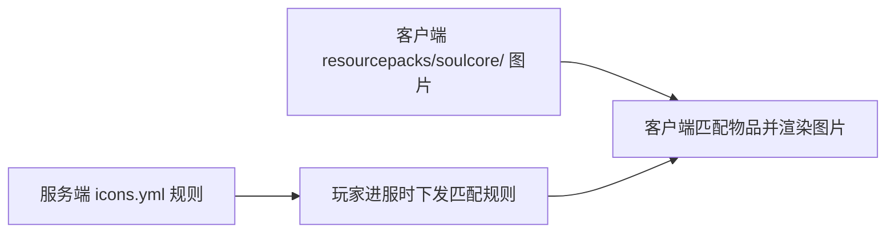

# 自定义物品图片

SoulCore 最核心的功能：让服务端通过匹配规则，把客户端物品替换为自定义图片。Paper 只下发匹配规则，**不发送图片文件**，每个玩家需要自行把图片放进自己的客户端目录。

## 工作原理



1. 服务端在 `plugins/SoulCore/modules/icons.yml` 配置匹配规则。
2. 玩家进服后，服务端通过协议通道把规则同步给兼容客户端。
3. 客户端根据规则匹配物品，用 `resourcepacks/soulcore/` 下的图片替换原版外观。

## 第一步：放置图片

把图片放入每个客户端自己的目录：

```text
.minecraft/resourcepacks/soulcore/
```

支持子目录、任意扩展名、任意分辨率。例如：

```text
.minecraft/resourcepacks/soulcore/soul_blade.png
.minecraft/resourcepacks/soulcore/weapons/fire_sword.png
```

仓库提供了可直接测试的示例：`examples/item-images/soul_blade.png` 与同名 `.mcmeta`，复制到上述目录即可。

### 图片动画

支持 Minecraft 原生动画元数据。在图片同目录放置同名 `.mcmeta` 文件：

```json
{
  "animation": {
    "frametime": 2,
    "frames": [0, {"index": 1, "time": 4}],
    "interpolate": true
  }
}
```

- 图片高度应包含所有垂直排列的动画帧。
- Minecraft 会按原生规则处理帧时长、帧顺序和插值。

## 第二步：配置匹配规则

编辑服务端 `plugins/SoulCore/modules/icons.yml`，在 `icons:` 节点下添加规则：

```yaml
icons:
  soul_blade:
    match:
      material: diamond_sword
    texture: soul_blade.png
```

`diamond_sword` 会自动转换为 `minecraft:diamond_sword`。

::: warning 注意
- 每条规则的 `match` 中**至少需要一种**匹配方式。
- 填写多个匹配条件时，**所有条件都必须满足**。
- 一条规则只有一个 `icons:` 根节点，多条规则都放在它下面。
:::

## 匹配方式

### 名称和 Lore 精确匹配

```yaml
icons:
  soul_blade:
    match:
      material: diamond_sword
      name: "Soul Blade"
      lore: "Legendary"
    texture: weapons/soul_blade.png
    handheld: true
```

- `name`：精确匹配完整物品名称。
- `lore`：精确匹配任意一行 Lore。

### 正则表达式匹配

```yaml
icons:
  legendary_blade:
    priority: 100
    match:
      material: diamond_sword
      name-regex: "^Soul Blade \\+\\d+$"
      lore-regex: "^(Legendary|Mythic)$"
    texture: weapons/legendary_blade.png
    scale: 1.0
    handheld: true
```

正则使用 Java `Pattern` 语法，对完整名称或完整 Lore 行执行匹配。

### NBT 匹配

`match.nbt` 匹配物品 `minecraft:custom_data` 中的自定义 NBT，直接填写 `路径: 值`：

```yaml
icons:
  blue_blade:
    match:
      material: diamond_sword
      nbt:
        variant: blue
        stats.0.level: 7
        enabled: true
    texture: weapons/blue_blade.png
```

- 嵌套 Compound 和列表索引使用点路径，如 `stats.0.level`。
- 字符串、布尔值和数字会自动推断 NBT 类型。

需要 `EXISTS`、`CONTAINS`、`GLOB` 或手动指定类型时，使用高级数组格式：

```yaml
icons:
  blue_blade:
    match:
      material: diamond_sword
      nbt:
        - path: PublicBukkitValues.soulcore:variant
          operator: GLOB
          type: STRING
          value: 'blue-*'
        - path: PublicBukkitValues.soulcore:enabled
          operator: EXISTS
```

## 配置字段

| 字段 | 默认值 | 说明 |
|---|---|---:|
| `priority` | `0` | 数值越大，匹配优先级越高 |
| `match.material` | 无 | 物品注册 ID，可省略 `minecraft:` |
| `match.name` | 无 | 完整物品名称精确匹配 |
| `match.lore` | 无 | 任意一行 Lore 精确匹配 |
| `match.name-regex` | 无 | 完整物品名称正则匹配 |
| `match.lore-regex` | 无 | 任意一行 Lore 正则匹配 |
| `match.nbt` | 无 | Minecraft `custom_data` NBT 条件，支持嵌套路径和列表索引 |
| `texture` | 必填 | 相对于客户端 `resourcepacks/soulcore/` 的纹理路径 |
| `model` | 无 | GeckoLib `.geo.json` 模型路径；填写后优先使用 3D 模型 |
| `animations` | 无 | GeckoLib `.animation.json` 动画路径 |
| `glow-texture` | 无 | GeckoLib 发光层 PNG 路径 |
| `scale` | `1.0` | 图片显示缩放，范围 `0.1` 至 `4.0` |
| `handheld` | `false` | 是否使用手持物品变换 |

## GeckoLib 3D 物品模型

在同一个 `icons:` 节点下添加规则。`texture` 仍然必填：它用于匹配规则的资源就绪检查，也是模型加载失败时的回退图片。

```yaml
icons:
  gecko_soul_blade:
    priority: 100
    match:
      material: diamond_sword
      name: SoulBlade
    texture: items/soul_blade.png
    model: items/soul_blade.geo.json
    animations: items/soul_blade.animation.json
    glow-texture: items/soul_blade_glow.png
    scale: 1.0
    handheld: true
```

对应文件放在每个客户端的 `.minecraft/resourcepacks/soulcore/` 下：

```text
items/soul_blade.png
items/soul_blade.geo.json
items/soul_blade.animation.json
items/soul_blade_glow.png
```

- `animations` 和 `glow-texture` 可以省略。
- `model`、`animations` 与 `glow-texture` 都必须使用 `/` 分隔的规范相对路径。
- GeckoLib 已随 SoulCore Fabric Mod 内嵌。

## 应用配置

配置完成后执行：

```text
/soulcore reload
```

所需权限：`soulcore.reload`（默认 OP）。

## 完整示例

```yaml
icons:
  # 最简规则：所有钻石剑都显示 soul_blade.png
  soul_blade:
    match:
      material: diamond_sword
    texture: soul_blade.png

  # 精确匹配名称与 Lore
  legendary_blade:
    priority: 100
    match:
      material: diamond_sword
      name: "Soul Blade"
      lore: "Legendary"
    texture: weapons/legendary_blade.png
    handheld: true

  # 正则匹配强化武器
  upgraded_blade:
    priority: 90
    match:
      material: minecraft:diamond_sword
      name-regex: '^Soul Blade \+[0-9]+$'
      lore-regex: '^(Legendary|Mythic)$'
    texture: weapons/upgraded_blade.png
    handheld: true
```

## 常见问题

| 现象 | 解决 |
|---|---|
| 图片不生效 | 确认图片已放入客户端目录、文件名与 `texture` 一致、服务端已重载 |
| 优先级不生效 | `priority` 数值越大优先级越高；规则之间匹配条件重叠时检查优先级 |
| 3D 模型不显示 | 确认 `.geo.json` 路径正确、客户端目录存在模型与贴图、服务端已重载 |
| 动画不动 | 确认 `.png.mcmeta` 与图片同名且放在同目录，动画格式正确 |

## 下一步

- [装备外观](/guide/modules/equipment-appearance) —— 相似的匹配规则，作用于装备外观
- [HUD 文本与图片](/guide/modules/hud) —— 服务端下发的屏幕元素
